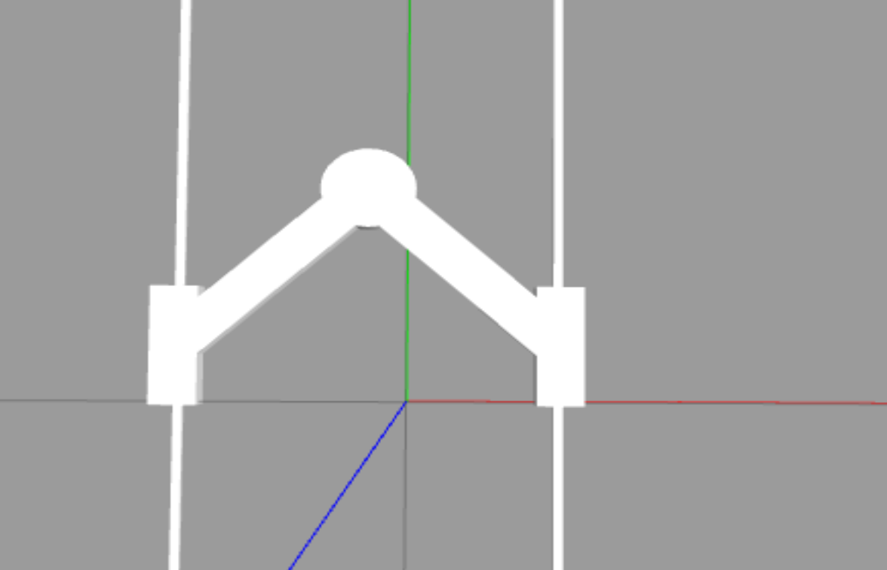

# Biglide Robot modeling and control

## Overview

This project involves the control and trajectory planning for a parallel robot named Biglide. The robot has two active joints and two passive joints, and its dynamics are modeled using geometric and kinematic equations. The control strategy implemented is Computed Torque Control (CTC), and trajectory planning is performed in Cartesian space.
### Biglide Robot

## Files

1. **biglide_models.py**: Contains the geometric and kinematic models for the Biglide robot, including functions for direct and inverse geometric/kinematic calculations, dynamic model, and trajectory planning.

2. **lab_amoro.parallel_robot.py**: Provides the Robot class for interfacing with the Biglide robot, including functions for applying efforts and accessing joint data.

3. **lab_amoro.plot_tools.py**: Includes the Scope class for real-time plotting of joint positions during the control loop.

4. **control.py**: The main script that initializes the ROS2 robot interface, computes trajectories, implements the CTC controller, and updates joint positions in real-time.

5. ****biglide_models_2.py** : Same of biglide_models.py but with different implementations

## Usage

1. **Dependencies**: Ensure that all necessary dependencies are installed, including ROS2, NumPy, and Matplotlib.

2. **Run the Code**: Execute the `control.py` script to start the control loop. The robot will perform trajectory tracking based on the computed trajectories in Cartesian and joint spaces.

3. **Trajectory Planning**: Trajectories can be modified by adjusting the `initial_position`, `final_position`, and `duration` parameters in the `compute_trajectory` function.

4. **Controller Tuning**: Controller gains (`Kp` and `Kd`) for the CTC controller can be adjusted in the `main` function to achieve desired control performance.

## Notes

- This project assumes the use of the Gazebo simulator for visualizing the Biglide robot and trajectories.

- Ensure that Gazebo is properly installed and configured with the necessary plugins for robot simulation.

- The code requires the ROS2 environment to interface with Gazebo and control the robot.

